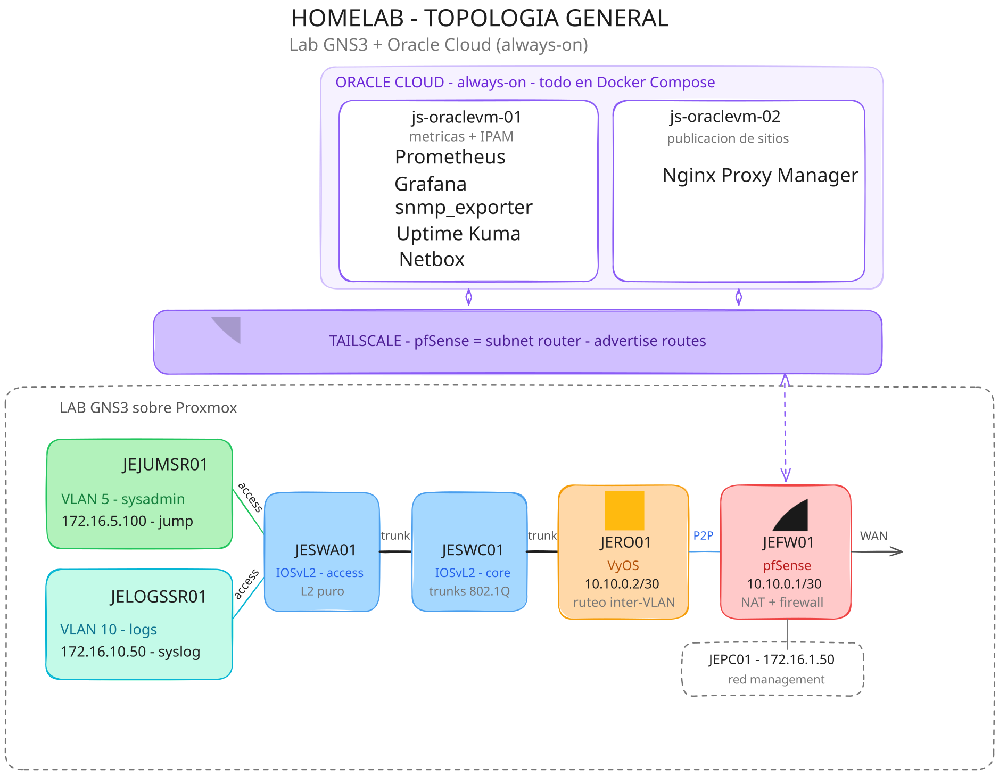

# :material-bridge: Arquitectura General

Este diagrama muestra de forma más detallada la arquitectura general del proyecto, que combina un laboratorio de red local en GNS3, con servicios siempre disponibles en la nube de Oracle que corren en contenedores Docker.

/// caption
Vista completa: laboratorio local (GNS3 sobre Proxmox) y servicios always-on (Oracle Cloud), unidos por Tailscale.
///

El proyecto combina dos entornos con propósitos distintos: un laboratorio de red que se levanta bajo demanda y una capa de servicios que permanece siempre disponible. La forma en que se conectan es, en sí misma, una decisión de diseño.

## Laboratorio de red local

El laboratorio corre en GNS3 sobre Proxmox. Emular red es intensivo en CPU y mantenerlo encendido de forma permanente es costoso, por lo que se levanta bajo demanda.

## Servicios en Oracle Cloud

Lo que sí necesita estar disponible en cualquier momento corre en Oracle Cloud, en dos instancias ARM64 always-on. `js-oraclevm-01` aloja el stack de monitoreo (Prometheus, Grafana, snmp_exporter, Uptime Kuma) y NetBox como IPAM; `js-oraclevm-02` aloja NPM, el reverse proxy que decide qué se publica hacia internet. Cada servicio vive en su propio Docker Compose, sin nada instalado de forma nativa salvo Tailscale.

## Tailscale como unión entre ambos entornos

Tailscale forma una malla privada entre las instancias de Oracle Cloud y la red del laboratorio, con pfSense actuando como subnet router y anunciando las rutas internas hacia el resto de la tailnet.

## Resumen de componentes

| Componente                 | Rol                                              | Detalle                         |
| -------------------------- | ------------------------------------------------ | ------------------------------- |
| Laboratorio (GNS3/Proxmox) | Red simulada: firewall, routing, switching       | [Red](red.md)                   |
| Oracle Cloud               | Servicios always-on en Docker                    | [Servicios](servicios/index.md) |
| Tailscale                  | Conectividad entre ambos, sin exposición directa | —                               |
| NPM + DuckDNS              | Publicación selectiva hacia internet             | [NPM](servicios/npm.md)         |
