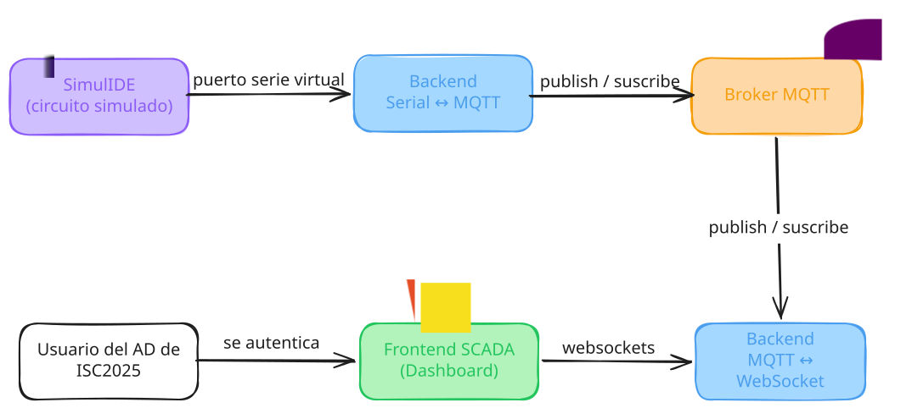

# Dashboard SCADA sobre SimulIDE — Sistemas de Control

> **Asignatura:** Introducción a los Sistemas de Control — UTEC
> **Modalidad:** trabajo en equipo entre 3 personas

## 1. Qué es

Circuito (Arduino, motores paso a paso, LEDs, sensores de temperatura) simulado en **SimulIDE**,
monitoreado en tiempo real mediante un dashboard web tipo SCADA.

## 2. Diagrama

Dos backends Node.js desacoplados por un broker **MQTT**:

- **Backend Serial↔MQTT**: lee eventos del circuito por el puerto serie virtual y los publica al broker; también puede escribir comandos de vuelta al circuito.
- **Backend MQTT↔WebSocket**: se suscribe al broker y los reenvía al frontend por WebSocket; también recibe acciones del usuario desde el frontend y las publica al broker.
- **Auth**: Keycloak (OIDC) — acceso limitado a usuarios registrados de la materia.

## 3. Por qué esa arquitectura

El broker MQTT es el único punto en común: ningún backend conoce al otro,
solo hablan con el broker. Así se puede agregar otro cliente (otra pantalla,
otro simulador) sin tocar el resto del sistema.

## 4. Stack Utilizado

Node.js · MQTT · WebSockets · Keycloak (OIDC) · SimulIDE · Arduino · HTML, CSS, JavaScript

## 5. Capturas

<!-- TODO: subir imágenes a docs/assets/proyectos-carrera/ y descomentar -->
<!--  -->
<!-- *Dashboard web mostrando el estado del circuito en tiempo real.* -->

<!--  -->
<!-- *Circuito armado en SimulIDE: Arduino, motores paso a paso y LEDs.* -->