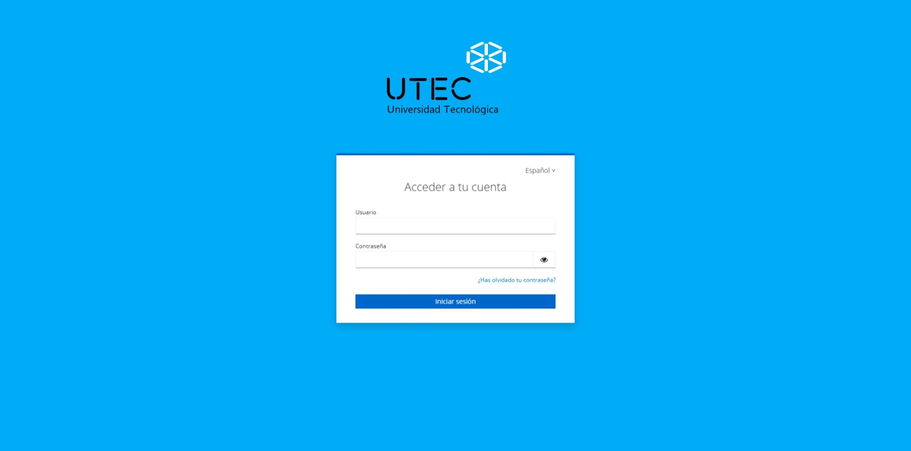
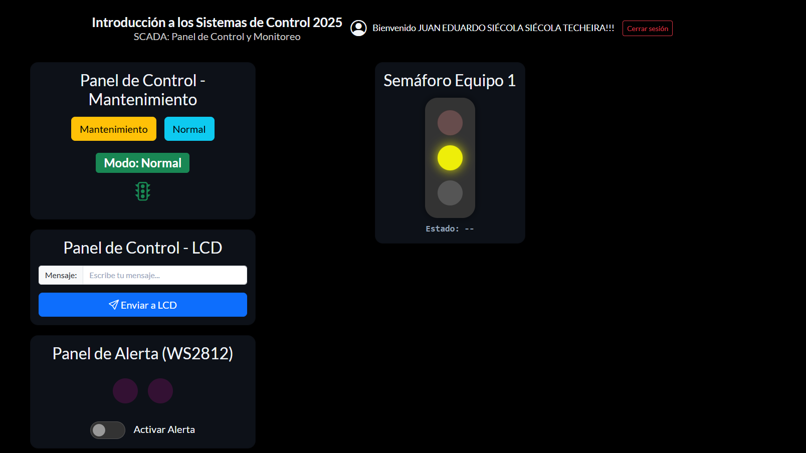
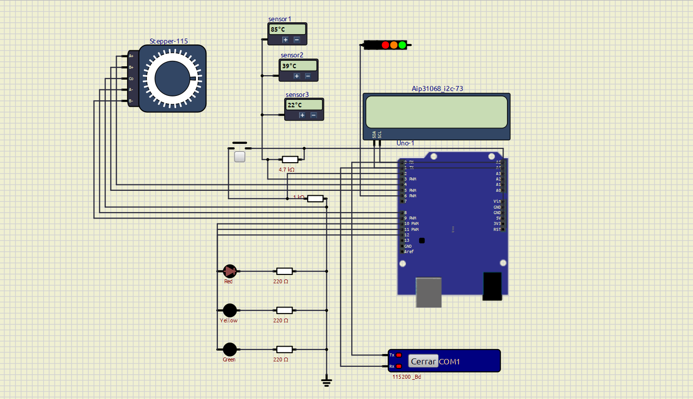

# Dashboard SCADA Sistemas de Control

## Resumen

Proyecto de equipo en el que armamos un sistema de monitoreo y control en tiempo real, similar a los que se usan en plantas industriales (SCADA). Simulamos un circuito electrónico con sensores y motores, y lo manejamos desde un panel web con acceso solo para usuarios registrados.

---

## Stack Utilizado

| Área | Tecnologías |
| --- | --- |
| **Simulación y hardware** | :material-chip: SimulIDE :simple-arduino: Arduino :simple-espressif: ESP32 |
| **Backend** | :simple-nodedotjs: Node.js |
| **Comunicación en tiempo real** | :simple-mqtt: MQTT :material-swap-horizontal: WebSockets |
| **Autenticación** | :simple-keycloak: Keycloak (OIDC) |
| **Frontend** | :simple-html5: HTML :fontawesome-brands-css3-alt: CSS :simple-javascript: JavaScript |
| **Despliegue y herramientas** | :simple-docker: Docker :simple-git: Git :simple-gitlab: GitLab |

---

## Diagrama

- **Backend Serial↔MQTT**: lee eventos del circuito por el puerto serie virtual y los publica al broker, también puede escribir comandos de vuelta al circuito.
- **Backend MQTT↔WebSocket**: se suscribe al broker y los reenvía al frontend por WebSocket, también recibe acciones del usuario desde el frontend y las publica al broker.
- **Autenticacion**: Keycloak con acceso limitado a usuarios registrados de la materia.

---

## Capturas

