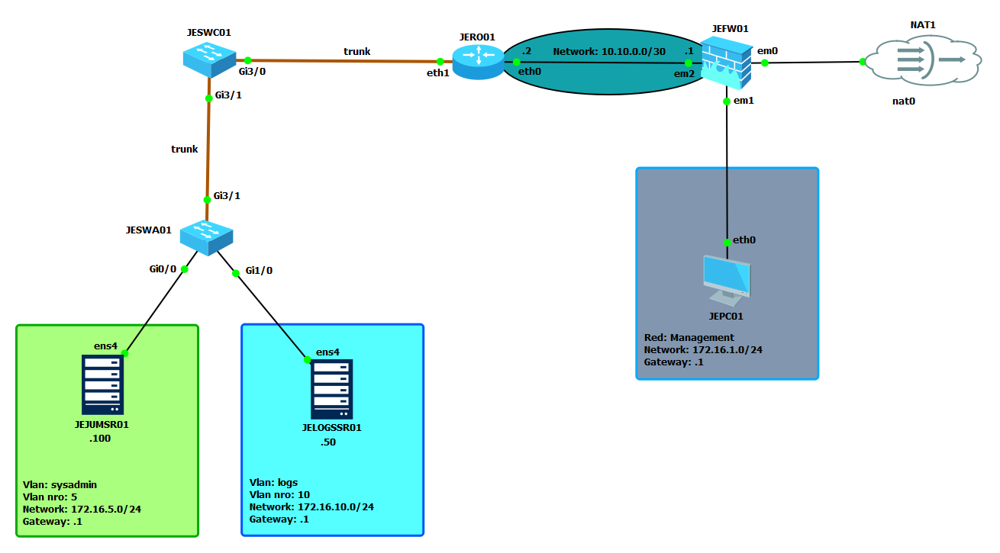
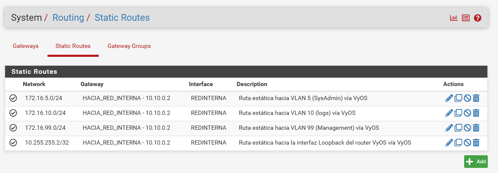

# Direccionamiento y topología de Red

## Topología

- Routing inter-VLAN centralizado en un único punto: JERO01 (VyOS), router-on-a-stick sobre subinterfaces 802.1Q.
- Switching puramente L2 en JESWC01 (core) y JESWA01 (access).
- 3 VLANs: Sysadmin (5), Logs (10), Management de switches (99).
- Una subred por VLAN, más una subred de management fuera de VLANs y un enlace P2P entre JEFW01 (pfSense) y JERO01 (VyOS).

## Direccionamiento

### Subredes

| Red             | Descripción                   | Gateway     | Vlan ID |
| --------------- | ----------------------------- | ----------- | ------- |
| 10.10.0.0/30    | P2P JEFW01 ↔ JERO01           | —           | -       |
| 172.16.1.0/24   | Management (fuera de VLANs)   | 172.16.1.1  | -       |
| 172.16.5.0/24   | VLAN 5 — Sysadmin             | 172.16.5.1  | 5       |
| 172.16.10.0/24  | VLAN 10 — Logs                | 172.16.10.1 | 10      |
| 172.16.99.0/24  | VLAN 99 — Management switches | 172.16.99.1 | 99      |
| 10.255.255.1/32 | Interfaz de loopback pfSense  | -           | -       |
| 10.255.255.2/32 | Interfaz de loopback VyOS     | -           | -       |

---

### VLANs

| VLAN | Nombre              | Asignación                           |
| ---- | ------------------- | ------------------------------------ |
| 5    | Sysadmin            | Access en JESWA01 Gi0/0 → JEJUMSR01  |
| 10   | Logs                | Access en JESWA01 Gi1/0 → JELOGSSR01 |
| 99   | Management switches | SVI en JESWC01 y JESWA01             |

---

### Direccionamiento por dispositivo

| Dispositivo      | Rol                | Interfaz    | IP              | Red                          |
| ---------------- | ------------------ | ----------- | --------------- | ---------------------------- |
| JEFW01 (pfSense) | Firewall borde     | em0         | DHCP            | WAN → NAT1                   |
|                  |                    | loopback lo | 10.255.255.1/32 | Interfaz de loopback pfSense |
|                  |                    | em1         | 172.16.1.1/24   | Management                   |
|                  |                    | em2         | 10.10.0.1/30    | P2P → JERO01                 |
| JERO01 (VyOS)    | Router Core        | eth0        | 10.10.0.2/30    | P2P → JEFW01                 |
|                  |                    | loopback lo | 10.255.255.2/32 | Interfaz de loopback VyOS    |
|                  |                    | eth1        | trunk 802.1Q    | —                            |
|                  |                    | eth1.5      | 172.16.5.1/24   | VLAN 5 gateway               |
|                  |                    | eth1.10     | 172.16.10.1/24  | VLAN 10 gateway              |
|                  |                    | eth1.99     | 172.16.99.1/24  | VLAN 99 gateway              |
| JESWC01          | Core switch (L2)   | Gi3/0       | trunk           | → JERO01                     |
|                  |                    | Gi3/1       | trunk           | → JESWA01                    |
|                  | SVI VLAN 99        | vlan 99     | 172.16.99.10/24 | Management                   |
| JESWA01          | Access switch (L2) | Gi3/1       | trunk           | → JESWC01                    |
|                  |                    | Gi0/0       | access VLAN 5   | → JEJUMSR01                  |
|                  |                    | Gi1/0       | access VLAN 10  | → JELOGSSR01                 |
|                  | SVI VLAN 99        | vlan 99     | 172.16.99.20/24 | Management                   |
| JEJUMSR01        | Bastion/jump       | ens4        | 172.16.5.100/24 | VLAN 5                       |
| JELOGSSR01       | rsyslog collector  | ens4        | 172.16.10.50/24 | VLAN 10                      |
| JEPC01           | Cliente interno    | eth0        | 172.16.1.50/24  | Management                   |

---

## Routing

**JERO01 (VyOS)** — `show ip route`

| Red Destino   | Máscara / CIDR | Gateway Siguiente Salto | Interfaz  | Distancia Admin. |
| :------------ | :------------- | :---------------------- | :-------- | :--------------- |
| `0.0.0.0`     | `/0`           | `10.10.0.1`             | `eth0`    | 1 (static)       |
| `172.16.5.0`  | `/24`          | conectada               | `eth1.5`  | 0                |
| `172.16.10.0` | `/24`          | conectada               | `eth1.10` | 0                |
| `172.16.99.0` | `/24`          | conectada               | `eth1.99` | 0                |
| `10.10.0.0`   | `/30`          | conectada               | `eth0`    | 0                |

**JEFW01 (pfSense)** — System → Routing

---

## Por qué así

Todo el ruteo inter-VLAN vive en un solo nodo (JERO01), y los switches se mantienen 100% L2. La alternativa sería repartir SVIs de datos en JESWC01/JESWA01 y rutear ahí — la descarté porque duplica lógica de L3 en dispositivos que ya cumplen su rol siendo puro switching, y porque un único punto de ruteo es un único punto donde auditar y filtrar tráfico este-oeste. pfSense nunca ve tráfico entre VLANs internas — su rol es estrictamente norte-sur.