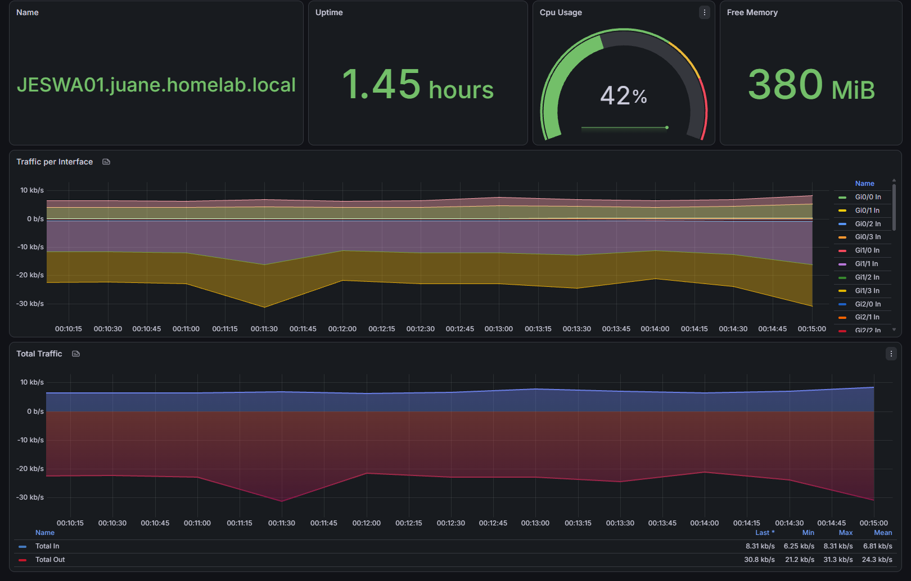
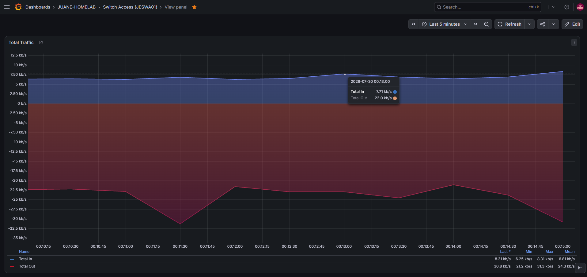

# :material-chart-box: Grafana

> **URL de Acceso:** `https://grafana.js-lab-uy.duckdns.org`

Grafana es la herramienta de visualización que convierte las métricas que junta Prometheus en dashboards. Es la cara visible del stack de monitoreo.

## 1. Propósito

Prometheus junta los números, pero nadie va a leer una API de series temporales a mano. Grafana traduce esas métricas en paneles: uso de interfaces, estado SNMP por dispositivo, tendencias en el tiempo. Es también el único componente del stack de métricas que se expone a internet, porque tiene su propia capa de autenticación.

---

## 2. Despliegue

| Servicio | Host                    | Acceso                                                    |
| -------- | ----------------------- | --------------------------------------------------------- |
| Grafana  | js-oraclevm-01 (Docker) | Público — NPM + DuckDNS (`grafana.js-lab-uy.duckdns.org`) |

---

## 3. Dashboards

/// caption
Dashboard principal con métricas SNMP del switch de acceso JESWA01, mostrando throughput de interfaces, CPU, sysName, Uptime y memoria.
///

/// caption
Panel individual de throughput de interfaces del switch de acceso JESWA01, con tráfico entrante y saliente en bits por segundo.
///

---

## 4. Fuentes de datos

* **Prometheus:** única data source configurada. Se alcanza por la red interna de Docker (`monitoring_network`), no por Tailscale, porque ambos contenedores comparten host.
* **Paneles clave:** estado SNMP por dispositivo, uso de interfaces, disponibilidad histórica.