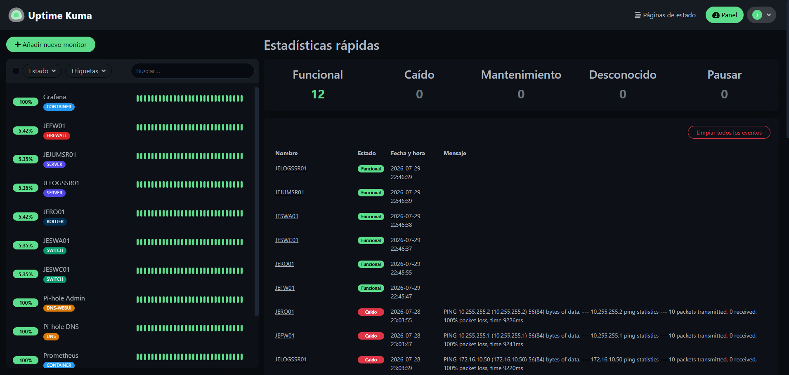
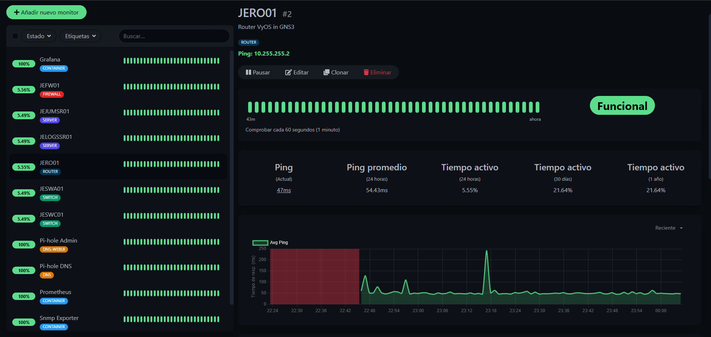
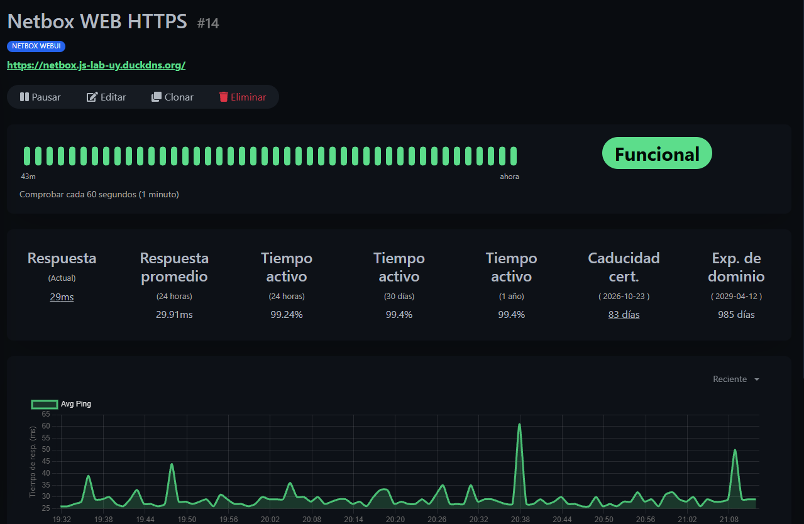

# :material-chart-line: Uptime Kuma (Monitoreo)

> **URL de Acceso:** `https://kuma.js-lab-uy.duckdns.org`

Uptime Kuma es un dashboard de monitoreo simple y de código abierto. En nuestra topología
nos sirve para saber si nuestros dispositivos de red están activos así como también nuestras páginas.

## 1. Propósito (Monitoreo de Servicios)

En nuestra topología, no es suficiente con "construir" los servicios, debemos asegurarnos de que se mantengan en línea. Uptime Kuma nos da una vista de controlador del estado de todos los componentes críticos del laboratorio.

Nos alerta visualmente (y podría enviar notificaciones) si un servicio o dispositivo se cae, permitiendo un diagnóstico rápido.

---

## 2. Despliegue

| Servicio    | Host                                                            | Acceso                                                 |
| ----------- | --------------------------------------------------------------- | ------------------------------------------------------ |
| Uptime Kuma | js-oraclevm-01 (Docker, compose separado del stack de métricas) | Público — NPM + DuckDNS (`kuma.js-lab-uy.duckdns.org`) |

## 3. Dashboard de Estado

El dashboard principal centraliza el estado de todos los monitores configurados, mostrando un "UP" (verde) o "DOWN" (rojo) para cada servicio.

/// caption
Vista general del dashboard de Uptime Kuma, mostrando el estado de todos los servicios monitoreados
///

/// caption
Detalle de un check en Uptime Kuma, mostrando información específica del estado del servicio monitoreado.
///

---

## 4. Monitores Clave

Kuma está configurado para vigilar todos los componentes de la topología usando diferentes métodos, estos son algunos ejemplos:

* **Monitores HTTP (Sitios Web):**
    * `NetBox`: Verifica que la interfaz web de NetBox responda correctamente.
    * `Grafana`: Consulta que el dashboard de Grafana esté accesible.
    * `pfSense WebGUI`: Verifica el estado de la interfaz de gestión del firewall.

* **Monitores Ping (ICMP):**
    * `Loopback pfSense (10.255.255.1)`: El monitor más crítico. Si este se cae, la red está rota.
    * `Loopback JERO01 (10.255.255.2)`: Verifica que el router de las VLANs esté en línea.
    * `Servidor Bastion (172.16.5.100)`: Asegura que el punto de acceso SSH esté vivo.

* **Monitores de Certificados SSL/TLS:**
    * `https://netbox.js-lab-uy.duckdns.org/`: Kuma también se encarga de monitorear la fecha de vencimiento de los certificados SSL/TLS, avisando 30 días antes de que expiren.

/// caption
Ejemplo de monitor de certificado SSL/TLS en Uptime Kuma, mostrando la fecha de expiración y el estado del certificado.
///