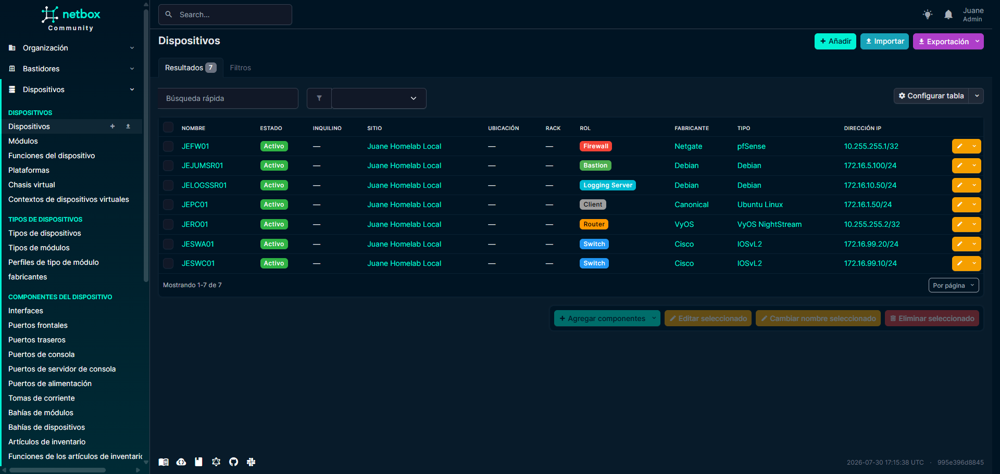
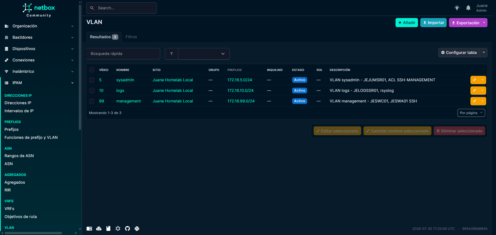
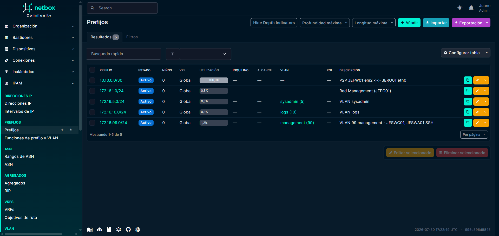
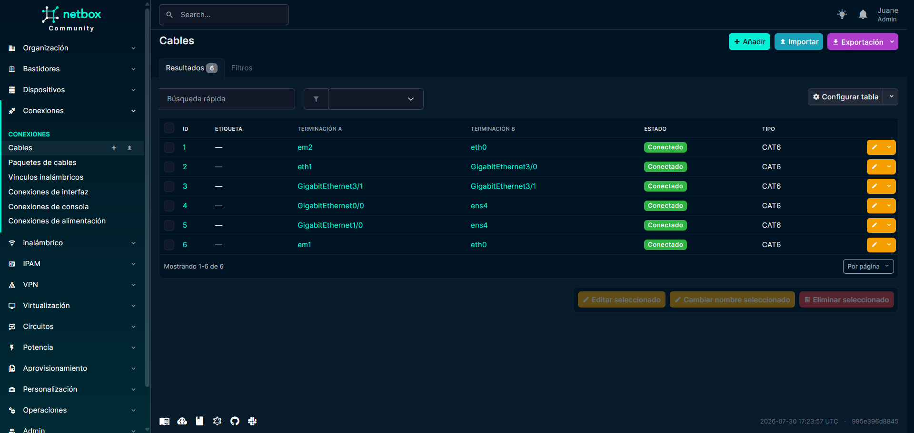

# :material-file-document: NetBox (Source of Truth)

> **URL de Acceso:** `https://netbox.js-lab-uy.duckdns.org`

NetBox es una herramienta de código abierto para la gestión de infraestructura. Es el componente más importante de nuestra gestión: actúa como la fuente de confianza de nuestro laboratorio.

## 1. Propósito

Netbox es la fuente de verdad (source of truth) de la red, donde se documenta todo: dispositivos, interfaces, VLANs, direcciones IP, cables, etc. Corre en `js-oraclevm-01` y es publicado a internet vía NPM + DuckDNS.

---

## 2. Despliegue

| Servicio | Host                    | Acceso                                                   |
| -------- | ----------------------- | -------------------------------------------------------- |
| NetBox   | js-oraclevm-01 (Docker) | Público — NPM + DuckDNS (`netbox.js-lab-uy.duckdns.org`) |

---

## 3. Vistas del inventario

NetBox proporciona una vista detallada y relacional de todos los componentes de la infraestructura. Las vistas más importantes son el IPAM (gestión de IPs) y el inventario de dispositivos.

### 3.1 Dispositivos

/// caption
Inventario de dispositivos en NetBox, con detalles de cada uno y su relación con otros componentes de la red (interfaces, VLANs, direcciones IP, etc.).
///

### 3.2 Vlans

/// caption
Listado de VLANs en NetBox, con sus respectivos IDs, nombres, prefijos y descripciones.
///

### 3.3 Prefijos

/// caption
Listado de prefijos en NetBox, con sus respectivos IDs, direcciones y descripciones.
///

### 3.4 Cableado

/// caption
Vista del cableado en NetBox, mostrando las conexiones entre dispositivos y sus interfaces.
///

## 4. Componentes Documentados

La base de datos de NetBox ha sido poblada para reflejar exactamente la topología del laboratorio GNS3:

* **Sitio:** Se creó un sitio (`Juane Homelab Local`) para alojar todos los dispositivos.
* **Fabricantes y Modelos:** Se crearon `Device Types` para `Cisco`, `VyOS`, `pfSense`, `Debian`, etc., con sus respectivas interfaces (`GigabitEthernet0/0`, `eth0`, `ens4`).
* **Dispositivos:** Todos los dispositivos de la topología (`JERO01`, `JESWA01`, `JJUMSR01`, etc.) han sido creados y asignados a sus roles.
* **VLANs y Prefijos:** Todas las VLANs (1, 5, 99) y subredes (Prefixes) están registradas.
* **Cables:** Todas las conexiones físicas (virtuales) entre dispositivos en GNS3 se han replicado como "cables" en NetBox, conectando interfaces específicas.