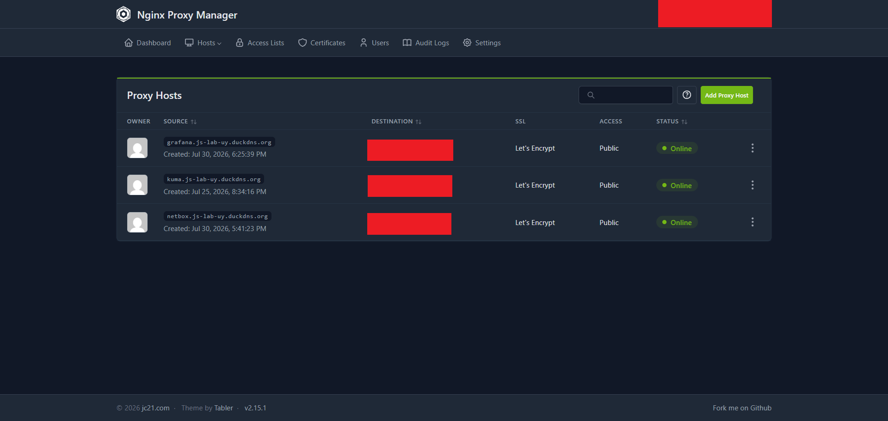

# :material-router-network: NPM (Nginx Proxy Manager)

> **Acceso a la consola:** Solo Tailscale (puerto 81) — NPM publica los demás servicios, no se publica a sí mismo.

## 1. Propósito

Un solo reverse proxy centraliza certificados y reglas de exposición en un lugar, en vez de que cada servicio maneje su propio TLS. La consola de administración (puerto 81) queda Tailscale-only a propósito, es el panel que decide qué sale a internet, exponerlo sería peligroso.

### 1.1 DuckDNS

DuckDNS es un proveedor de DNS dinámico gratuito. Normalmente se usa para mantener un dominio apuntando a una IP que cambia (actualizando el registro automáticamente), pero en este lab la IP pública de `js-oraclevm-02` es estática, así que esa función 
central no se usa. Se eligió por dos motivos concretos:

- **Dominio gratuito**: evita pagar por uno propio solo para exponer servicios en cloud.
- **Wildcard DNS**: con `*.js-lab-uy.duckdns.org` activado, cualquier subdominio (`grafana.js-lab-uy.duckdns.org`, `kuma.js-lab-uy.duckdns.org`, etc.) resuelve a la misma IP sin tener que registrar cada uno por separado.

NPM usa esos subdominios para el reverse proxy: según el Host header de la request, 
decide a qué servicio interno redirigir el tráfico.

---

## 2. Despliegue

| Servicio | Host                    | Acceso                                              |
| -------- | ----------------------- | --------------------------------------------------- |
| NPM      | js-oraclevm-02 (Docker) | Público (80/443) — admin (puerto 81) solo Tailscale |

---

## 3. Web UI

/// caption
Nginx Proxy Manager: listado de proxy hosts con los servicios publicados.
///

---

## 4. Detalle

* NPM publica Grafana, Uptime Kuma y Netbox, que corren en `js-oraclevm-01`. El forward host apunta a la IP Tailscale de esa instancia, no a un contenedor local, esto se debe a que tailscale resuelve la conectividad entre las dos VMs igual que si estuvieran en la misma red.
* Certificados gestionados vía Let's Encrypt, con renovación automática.